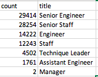
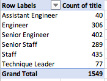

# Pewlett_Hackard_Analysis
## Analysis Overview
To help Pewlett Hackard identify employees who are close to retirement and honor them with a retirement package, as well as understand the job position vacancies these retirements will bring about so they can prepare for headcount planning 

## Results

* Based on the list of employees retiring who were born between 1952 - 1955, it can be seen that there are a total of 90,398 positions that PH will need to think about filling

* Based on the table below, it can be seen that about 64% of the positions of employees who will be retiring are that of Senior Engineer and Senior Staff so PH can focus a majority of their energy trying to fill/reallocate resources for these 2 positions.

* Based on the employee list who are eligible for the mentorship program, it can be seen that there are 1,549 employees that PH management can reach out to for targeted approach stratgies

* Based on the table below, it can be seen that management can target their mentorship outreach messaging to the Engineer, Senior Engineer, Senior Staff and Staff positions as they make up about 92% of the overall retiring employees who are eligible for mentorship

## Summary
As indicated in the analysis above, there will be a total of 90,398 positions that will need to be filled based on the birth dates between 1952-1955 alone. If this search criteria is expanded to a wider birth date range, the number of positions that PH will need to think about filling will be higher

Based on the mentorship eligibility analysis above, there are a total of 1,549 retirement ready employees to mentor the next generation of PH employees
